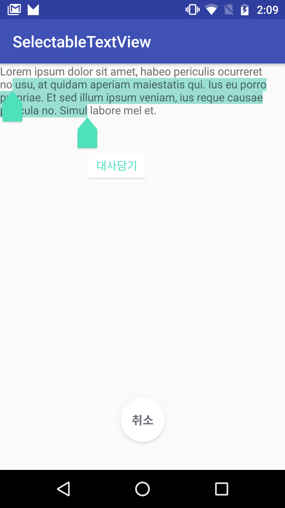

Android-Selectable-TextView
=====
Helper library for Android developers looking to selecte word in the textview.

Sample Capture
=====



Download
--------
use Gradle:

```gradle
 repositories {
  jcenter()
}

dependencies {
  compile 'net.jaedong:selectabletextview:1.0.0'
}
```

Or Maven:

```xml
<dependency>
  <groupId>net.jaedong</groupId>
  <artifactId>selectabletextview</artifactId>
  <version>1.0.0</version>
  <type>pom</type>
</dependency>
```


How do I use?
-------------------
You can see more detail from [MainActivity.java][1].

Simple use cases will look something like this:
* XML

```xml
    <net.jaedong.textview.SelectableView
        android:layout_width="wrap_content"
        android:id="@+id/selectableView"
        android:layout_height="wrap_content" />

```

* JAVA

```java
public class MainActivity extends AppCompatActivity {

    private TextView emptyBoxBtn;
    private SelectableView selectableView;

    @Override
    protected void onCreate(Bundle savedInstanceState) {
        super.onCreate(savedInstanceState);
        setContentView(R.layout.activity_main);

        selectableView = (SelectableView) findViewById(R.id.selectableView);
        selectableView.setActivity(this);
        selectableView.setText(getString(R.string.sample_text));
        selectableView.addOnSaveClickListener(new SelectableListener() {
            @Override
            public void selectedText(String text) {
                Log.e("TAG", text);
                Toast.makeText(MainActivity.this, text, Toast.LENGTH_LONG).show();
            }
        });

        emptyBoxBtn = (TextView) findViewById(R.id.emptyBoxBtn);
        emptyBoxBtn.setTag(0);
        emptyBoxBtn.setOnClickListener(new View.OnClickListener() {
            @Override
            public void onClick(View view) {
                int type = (int) view.getTag();
                if (type == 0) {
                    emptyBoxBtn.setBackgroundResource(R.drawable.selector_cancel_btn);
                    selectableView.selectAll();
                    emptyBoxBtn.setTag(1);
                } else {
                    emptyBoxBtn.setBackgroundResource(R.drawable.selector_emptybox);
                    selectableView.hideCursor();
                    emptyBoxBtn.setTag(0);
                }
            }
        });
    }
}
```


Updated
------
```
v 1.0.0 - First Released.
```

Author
------
Jaedong Kim - @JackDinealKIM on GitHub,
mashiaro@gmail.com

License
-------
```code
Copyright 2017 JD Kim

Licensed under the Apache License, Version 2.0 (the "License");
you may not use this file except in compliance with the License.
You may obtain a copy of the License at

http://www.apache.org/licenses/LICENSE-2.0

Unless required by applicable law or agreed to in writing, software
distributed under the License is distributed on an "AS IS" BASIS,
WITHOUT WARRANTIES OR CONDITIONS OF ANY KIND, either express or implied.
See the License for the specific language governing permissions and
limitations under the License.
```

[1]: https://github.com/JackDinealKIM/SelectableTextView/blob/master/app/src/main/java/net/jaedong/selectable_sample/MainActivity.java


